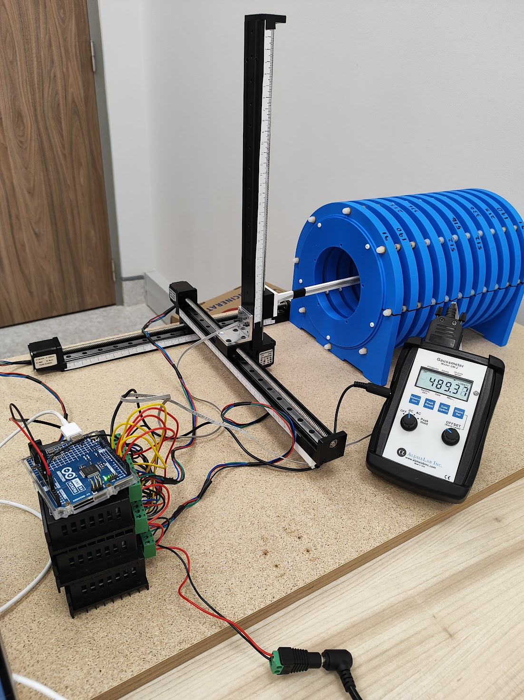
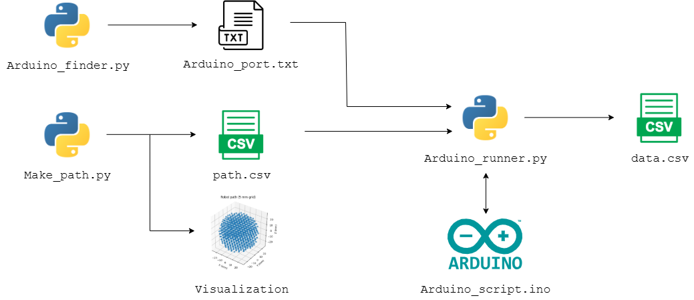
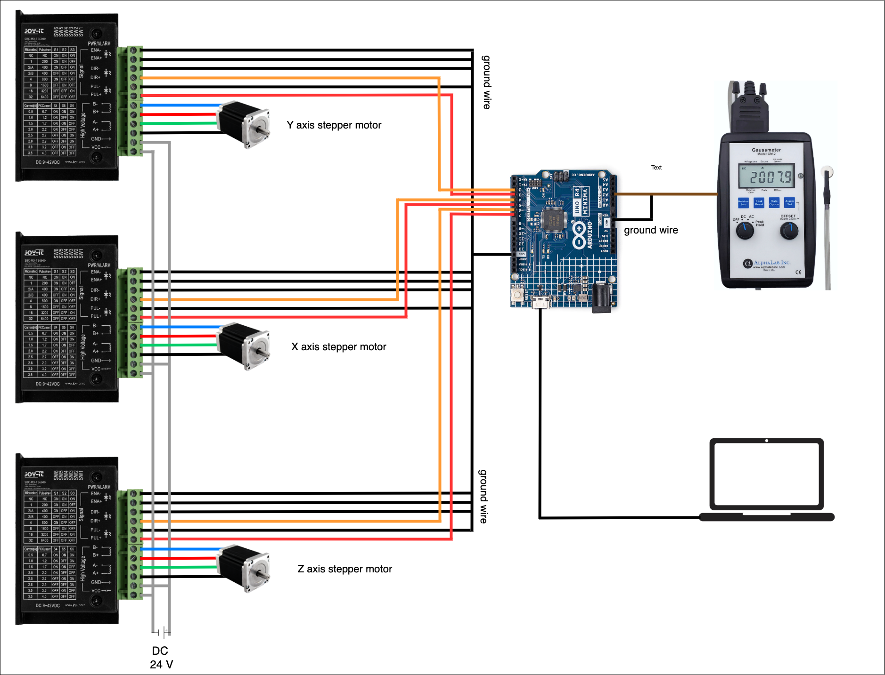
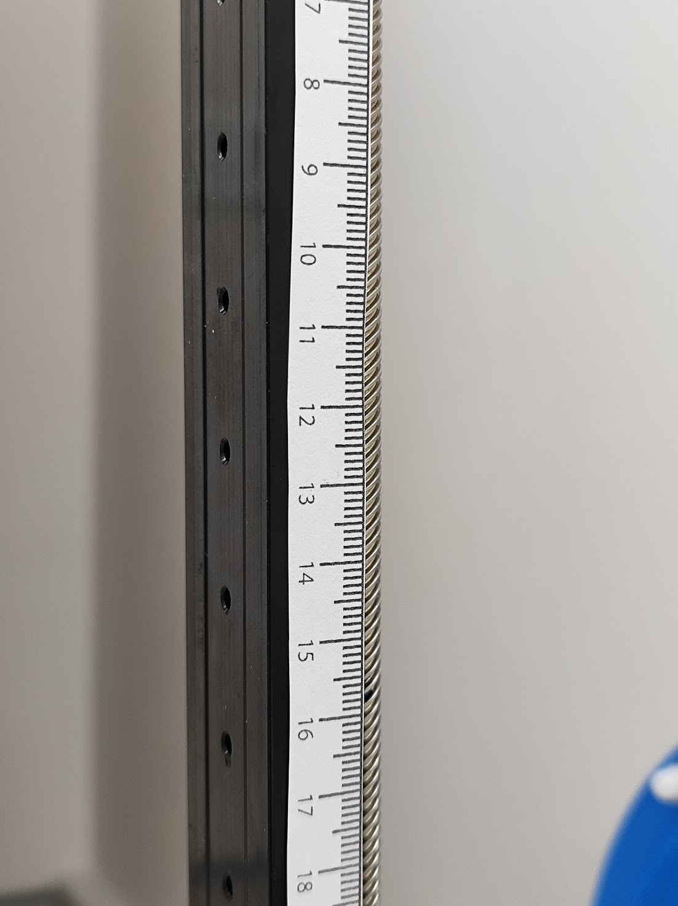
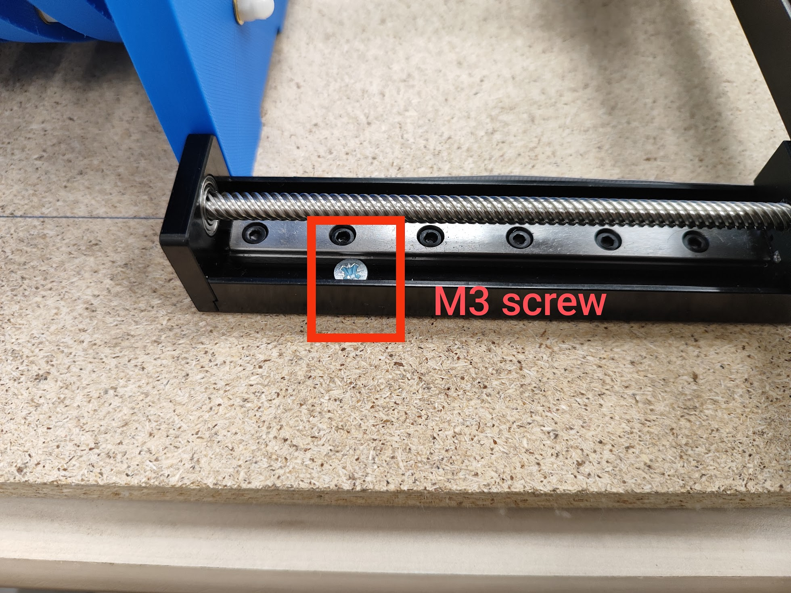
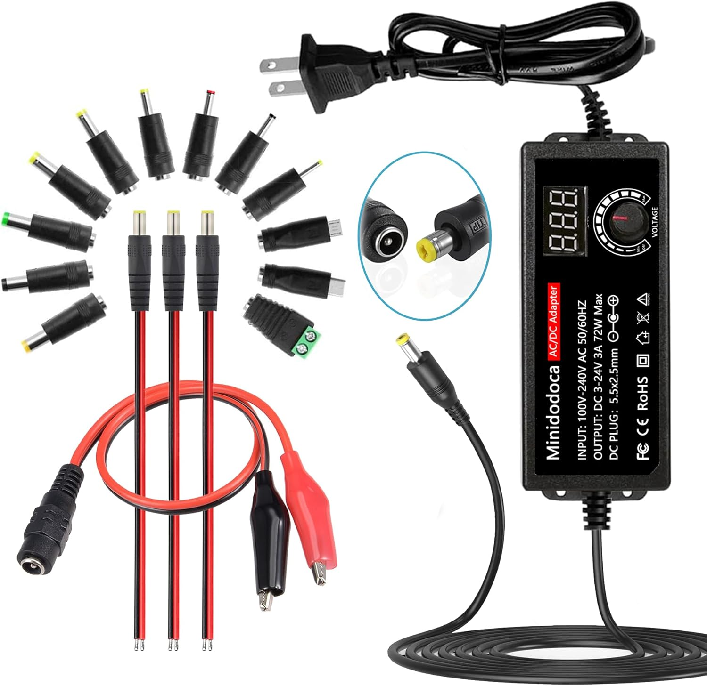
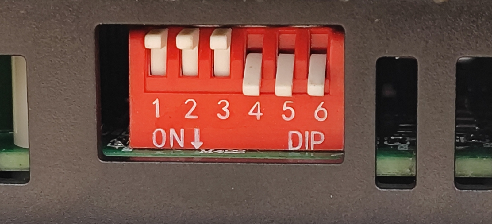

# Field Mapper Robot

## Overview
Design of a **modular, cost‑effective robot** for mapping magnetic fields within a defined volume.

  

---

## Requirements
| **Software** | **Description**                               | **Download Link**                        |  
|--------------|-----------------------------------------------|------------------------------------------|  
| Pycharm   | Pyhton IDE (Pyhton 3.13) | [Link](https://www.jetbrains.com/pycharm/) |  
| Arduino IDE   | Native software of Arduino | [Link](https://www.arduino.cc/en/software/) |

---

## Bill of Materials
| Component | Qty | Unit Price (USD) | Link |
|---|:---:|:---:|---|
| Linear stages (Z 300 mm, XY 300 mm – 12 mm pitch) | 1 | 338.54 | [Product](https://www.aliexpress.us/item/3256805348651313.html?spm=a2g0o.order_detail.order_detail_item.3.5fa4f19cjVbIP4&gatewayAdapt=glo2usa) |
| TB6600 stepper driver | 3 | 5.60 | [Product](https://www.aliexpress.us/item/3256805781393725.html?spm=a2g0o.order_detail.order_detail_item.2.1ed6f19cobQnNT&gatewayAdapt=glo2usa) |
| Arduino UNO R4 Minima | 1 | 16.00 | [Product](https://thepihut.com/products/arduino-uno-r4-minima) |
| Gaussmeter GM2 | 1 | 902.00 | [Product](https://www.alphalabinc.com/products/gm2/?srsltid=AfmBOor0p2l-VF9fIRODsZqY854WaDDNnBIFsOJ6kHjN2p6iCgCOzTLX) |
| **Total** |  | **1262.14** |  |

---

## High‑Level Workflow

  

<h3 align="center"><em>Software workflow diagram</em></h3>

  

<h3 align="center"><em>Wiring diagram</em></
---

---
## Scripts Overview  

### `Arduino_finder.py`  

- Run once the arduino is connected 
- Finds the connection port name and writes it in Arduino_port.txt file 

### `Path_maker.py`  

- Generates the path trajectory with discrete points
- Allows user to modify the trajectory and spacing between individual points
- Visualizes the path in 3D with exact sequence the robot would follow, for user to validate
- Writes the x y z coordinates of the path in the right order in "path.CSV" file

### `Arduino_runner.py`  
- Allows user to input delay time for sensor read at each desired point and control the speed of robot movement
- Retrieves the coordinates from "path.CSV" file
- Generates text commands to move the robot according to the path
- Sends text commands to arduino at 9600 baud (defined by user) via Arduino port retrieved from Arduino.txt file
- Records voltage readings of Gaussmeter per data point and appends to corresponding coordinate
- Generates Data.CSV, containing x y z reading values for each coordinates

### `Arduino_script.ino`  
- Defines Pin map of the arduino
- Listens for simple text commands (X+, X-, Y+, Y-, Z+, Z-, READ) sent over USB at 9600 baud (Links Arduino_runner.py with Arduino)
- Moves the robot 1 mm per command by pulsing the chosen step pin 533.34 times (defined by callibration)
- Reads the sensor when given READ command (defined by the Arduino_runner.py)
- converts the analog singal from GM-2 Gaussmeter to volts using a 0.4901V reference (according to calibration), and prints it with five‑decimal accuracy.

---
## Assembly Tips

### 1 · Axis Ruler for Quick Calibration

  

Attaching a printed ruler minimises calibration time and ensures precise step‑to‑millimetre mapping.

### 2 · Mount on a Rigid Base

  

Secure the frame to a **≥ 40 × 60 × 1.5 cm** wooden panel for stability during operation.

### 3 · Variable DC Power Supply

  

A low‑cost variable supply (~15 USD) simplifies testing different motor voltages and current limits.

### 4 · TB6600 DIP‑Switch Settings

  

Set switches **S1–S6 = OFF** to match the firmware micro‑stepping and protect the motors.

---

## 3‑D Printable Parts
*Upload STL/STEP files in this directory and list them here.*

---

---

